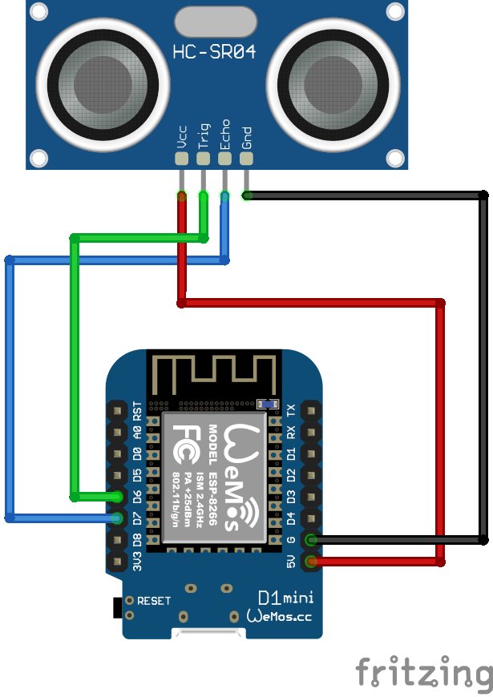

# Water Level Measurement using an Arduino and an Ultrasonic Sensor

The whole project was inspired by the work described in the following posts:

- [https://arduino-projekte.info/zisterne-fuellstandsanzeige](https://arduino-projekte.info/zisterne-fuellstandsanzeige)
- [https://arduino-projekte.info/zisterne-3-0-web-server-spiffs](https://arduino-projekte.info/zisterne-3-0-web-server-spiffs)

## Hardware & Wiring

- Ultrasonic Sensor: **HP-SR04**
- Board: **Wemos D1 mini**

### Board Manager

In this project, the **Wemos D1 mini** is utilized. To install this board
type in *Arduino IDE*, 

1. Add the following URL to *File -> Preferences -> Additional Boards Manager URLs*: [http://arduino.esp8266.com/stable/package_esp8266com_index.json](http://arduino.esp8266.com/stable/package_esp8266com_index.json).
2. Install the **esp8266** board via the _Boards Manager_.
3. Select "Wemos D1 mini" from the _ESP8266 Boards_ as the currently used board.

### Libraries

The following libraries are required:

- [ESPAsyncWebServer](https://github.com/me-no-dev/ESPAsyncWebServer)
- [ESPAsyncTCP](https://github.com/me-no-dev/ESPAsyncTCP)

Just clone them into the `Arduino/libraries` folder.  
Also add the `ArduinoJson` Library to the project.

## Upload Files

 -  Navigate to the `Sketch` folder an create a now folder called `data`. In this folder, all website-related stuff like images, `.css` or `.html` files are stored.
 - The flash size of the corresponding _ESP8266 Board_ should be set to `4M (FS:1MB)` or `4M (1M SPIFFS)`.
- `.html`, `.css` files and icons are uploaded using the [Arduino ESP8266 filesystem uploader](https://github.com/esp8266/arduino-esp8266fs-plugin).
- Download a release and put the resulting folder in the `tools` folder of your _Sketchbook_ folder.

